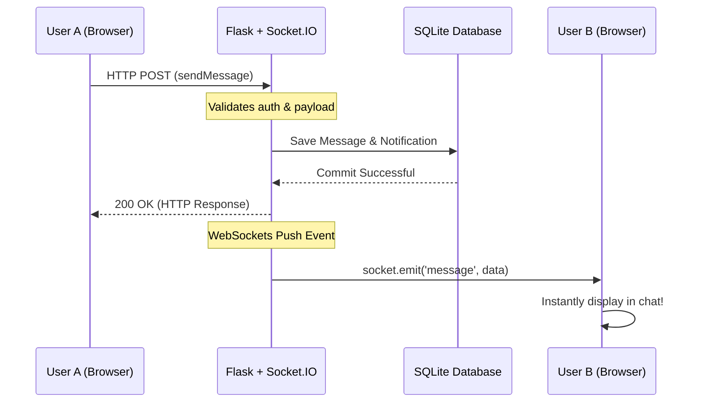
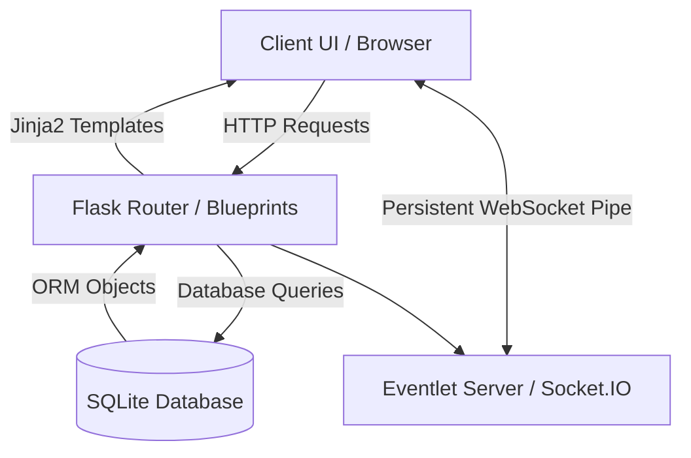

# 🛍️ KindKart: Community Peer-to-Peer Donation Platform


KindKart is an immersive, full-stack web application built to facilitate **community-driven resource allocation**. It functions as an interactive platform where users can donate essential items, respond to local needs, and communicate securely in real-time. Designed as a comprehensive academic project, it showcases robust MVC web architecture, real-time bidirectional communication, and secure relational data modeling.

---

## 🏗️ System Architecture & Workflows

KindKart relies on a structured **MVC (Model-View-Controller)** pattern combined with modern **WebSockets** for real-time functionalities.

### Real-Time Chat & Bidirectional Data Flow
Unlike traditional HTTP systems, KindKart utilizes an **Eventlet-powered WebSocket server** to push chat messages and notifications instantly to clients without page reloads.



### Full-Stack Architecture


---

## ✨ Core Features

1. **🔐 Secure Authentication Pipeline**
   - Robust CSRF validation, password hashing via `Bcrypt`, and session continuity using `Flask-Login`.
2. **📢 Dynamic Needs Board & Matchmaking**
   - A centralized hub where individuals broadcast requirements, and donors directly fulfill those needs through verified transaction protocols.
3. **⚡ Real-Time Socket.IO Communication**
   - Persistent bi-directional chat rooms connecting donors and recipients instantly, built on an asynchronous Eventlet engine.
4. **📸 Automated Media Optimization (Pillow)**
   - Smart image processing that automatically compresses, scales, and optimally stores uploaded files to limit bandwidth.
5. **⭐ Trust & Reputation Engine**
   - A multi-tier review system allowing users to award ratings (1-5 stars) dynamically, establishing a cumulative, visible community trust score.
6. **📍 Geospatial Asset Mapping**
   - Integration with `Leaflet.js` to render interactive mapping nodes for visualizing physical pickup constraints.

---

## 🛠️ Technology Stack

| Layer | Technologies Used |
| :--- | :--- |
| **Backend Framework** | Python 3.8+, Flask, Jinja2 |
| **Database & ORM** | SQLite, SQLAlchemy (`Flask-SQLAlchemy`) |
| **Real-Time Engine** | `Flask-SocketIO`, `eventlet` |
| **Security & Auth** | `Flask-Bcrypt`, `Flask-WTF`, CSRF Protection |
| **Frontend Utilities** | HTML5, CSS3, Vanilla JS, Google Fonts, FontAwesome |
| **Deployment Engine** | `Gunicorn` (WSGI Production Server) |

---

## 💻 Local Setup Instructions

**1. Clone or Download the Repository**
```bash
cd KindKart_
```

**2. Initialize Virtual Environment & Install Dependencies**
```bash
pip install -r requirements.txt
```

**3. Execution (Development Mode)**
KindKart features an auto-migrating database schema. Running the entry point automatically creates the SQLite database.
```bash
python run.py
```
*Access locally at `http://127.0.0.1:5000`*

---

## ☁️ Cloud Deployment (Render.com)

To transition from localhost to a permanent live cloud server with real-time WebSocket support:

1. **Initialize Git & Push to GitHub**:
    ```bash
    git init
    git add .
    git commit -m "Initial Release"
    ```
2. **Deploy via Render**:
    - Connect your GitHub to a new **Web Service** on Render.com
    - **Language**: Python 3
    - **Build Command**: `pip install -r requirements.txt`
    - **Start Command**: 
      ```bash
      gunicorn --worker-class eventlet -w 1 run:app
      ```
3. **Custom Domain (Optional)**:
    - In Render Dashboard -> Settings -> Custom Domains, input your premium domain and copy the generated DNS records to your registrar. The platform provisions SSL certificates automatically!

---

*Built with ❤️ for a stronger, more connected community.*
